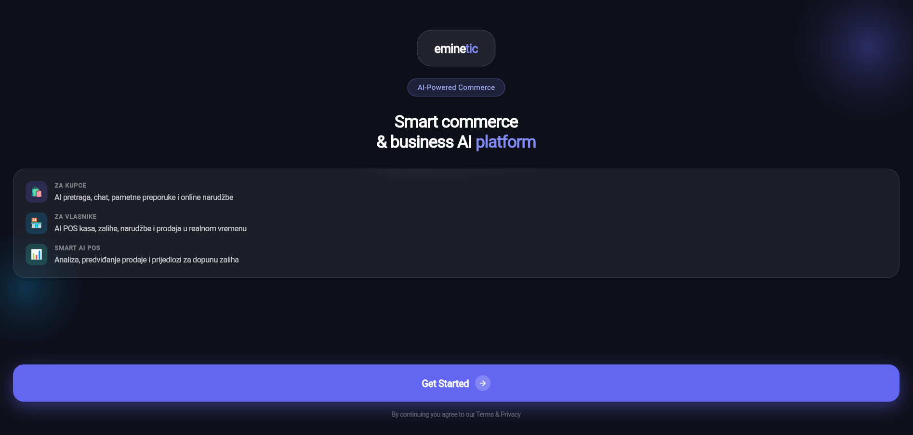
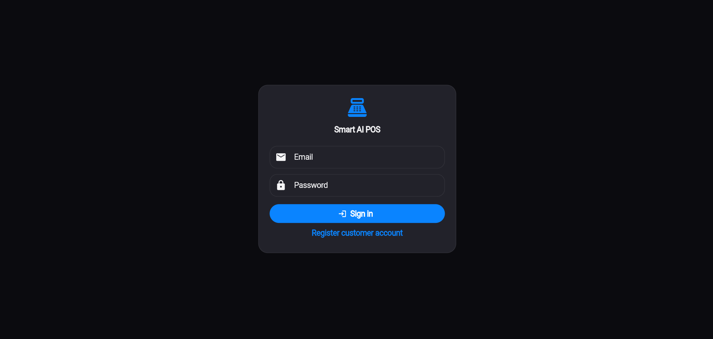
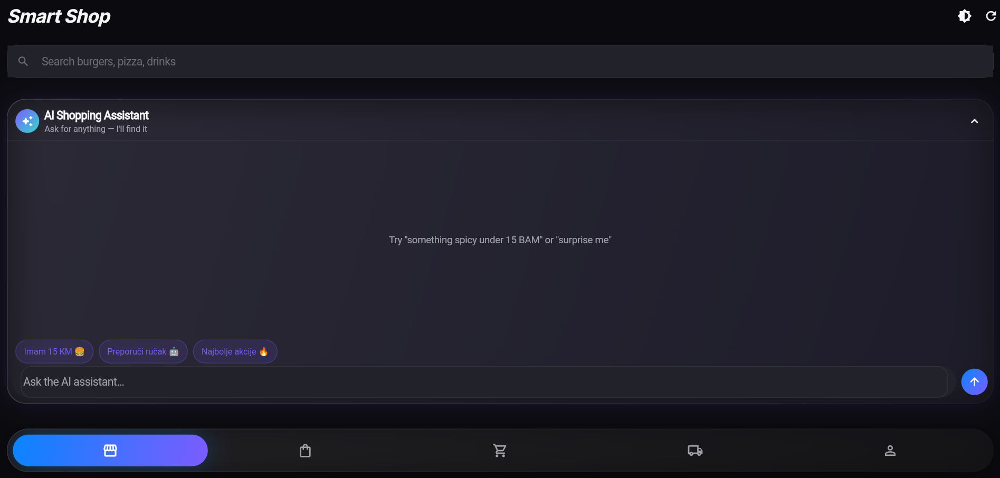
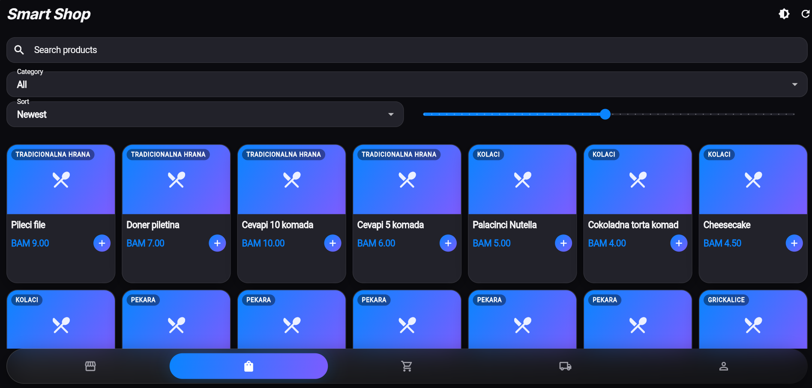
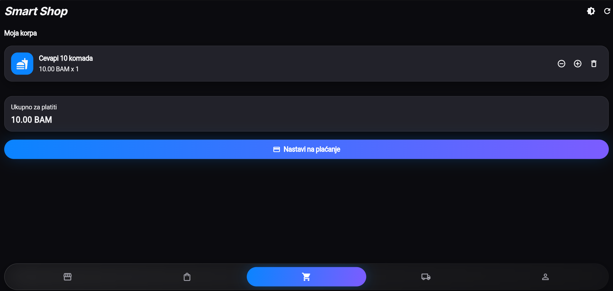
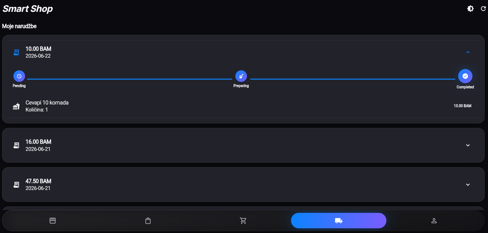
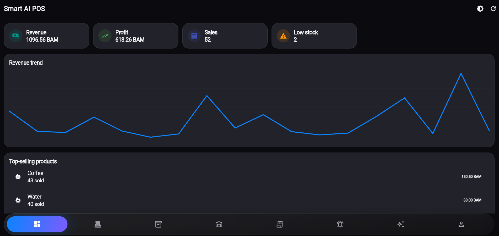
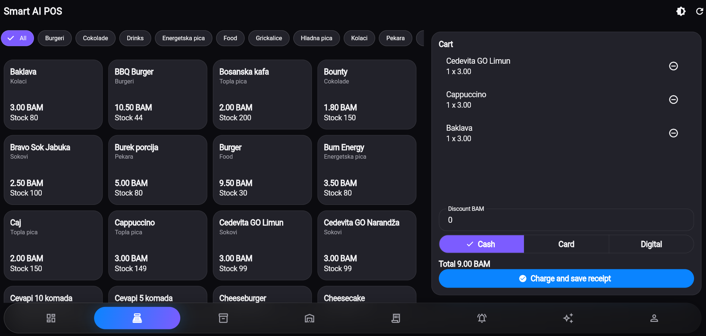
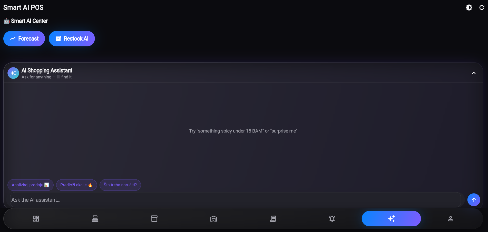
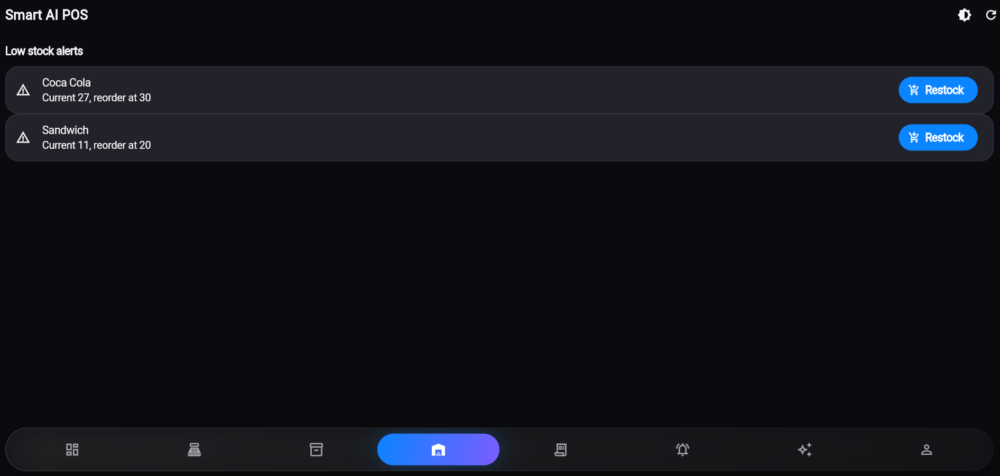

# 🚀 AI-Commerce & POS Platform

A modern AI-powered commerce platform that combines a Smart POS system, customer shopping application, inventory management, and AI analytics into one complete solution.

Built with **Flutter**, **.NET 8 Web API**, **SQL Server**, **Entity Framework Core**, and **Docker**.

---

# ✨ Features

## 🤖 Artificial Intelligence

- AI Shopping Assistant
- Intelligent Product Recommendation System
- Smart Deals Generator
- Sales Forecasting
- Inventory Refill Prediction
- Business Insights & Analytics

## 🛒 Customer Shopping

- Product Catalog
- Category Filtering
- Product Search
- Shopping Cart
- Checkout
- Order Tracking
- Customer Profile

## 🏪 POS System

- Cash & Card Payments
- Product Management
- Order Processing
- Receipt Generation
- Sales History
- Dashboard

## 📦 Inventory

- Stock Management
- Low Stock Alerts
- Inventory Updates
- Product Categories

## 📊 Analytics

- Revenue Statistics
- Profit Analysis
- Best Selling Products
- Sales Reports
- AI Insights

## 🔐 Security

- JWT Authentication
- Role-Based Authorization
- Refresh Tokens
- Password Hashing

---

# 🛠 Tech Stack

### Frontend

- Flutter
- Material 3
- Dart

### Backend

- .NET 8 Web API
- Entity Framework Core
- SQL Server

### Infrastructure

- Docker
- Docker Compose

### Authentication

- JWT
- Refresh Tokens

---
## 📸 Application Screenshots

| Welcome | Login |
|---------|-------|
|  |  |

| Customer Dashboard | Marketplace |
|-------------------|-------------|
|  |  |

| Shopping Cart | Checkout |
|--------------|----------|
|  |  |

| Admin Dashboard | POS Terminal |
|----------------|--------------|
|  |  |

| AI Analytics | Low Stock Alerts |
|-------------|------------------|
|  |  |
---


# 📂 Project Structure

```
AI-commerce-and-POS-platform
│
├── backend
│   ├── Controllers
│   ├── Services
│   ├── Repositories
│   ├── Models
│   ├── DTOs
│   ├── Data
│   └── Migrations
│
├── frontend
│   ├── assets
│   ├── lib
│   └── web
│
├── database
│   ├── schema.sql
│   ├── seed.sql
│   └── migrations
│
└── docker-compose.yml
```

---

# 🚀 Getting Started

## Backend

```bash
cd backend
dotnet restore
dotnet run
```

---

## Flutter

```bash
cd frontend
flutter pub get
flutter run
```

---

## Docker

```bash
docker compose up --build
```

---

# 🗄 Database

The project includes:

- SQL Server schema
- Seed scripts
- Entity Framework Core migrations
- Automatic demo data generation

---

# 👥 Demo Accounts

| Role | Email | Password |
|------|-------|----------|
| Admin | admin@smartpos.ba | Admin123! |
| Manager | manager@smartpos.ba | Manager123! |
| Cashier | cashier1@smartpos.ba | Cashier123! |
| Cashier | cashier2@smartpos.ba | Cashier123! |

---

# 🔗 API

Swagger

```
http://localhost:5000/swagger
```

Base URL

```
http://localhost:5000
```

---

# 📋 Main API Endpoints

## Authentication

- POST /auth/register
- POST /auth/login
- POST /auth/refresh

## Products

- GET /products
- POST /products
- PUT /products/{id}
- DELETE /products/{id}

## Sales

- GET /sales
- POST /sales/create

## Inventory

- GET /inventory/low-stock
- POST /inventory/update

## AI

- GET /ai/forecast-sales
- GET /ai/recommend-restock
- GET /ai/insights

## Dashboard

- GET /dashboard/stats

---
